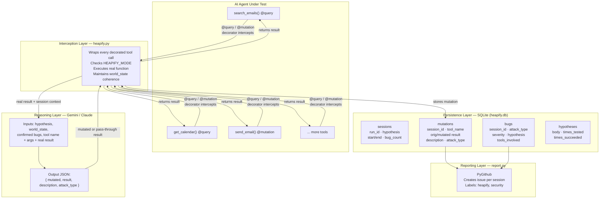
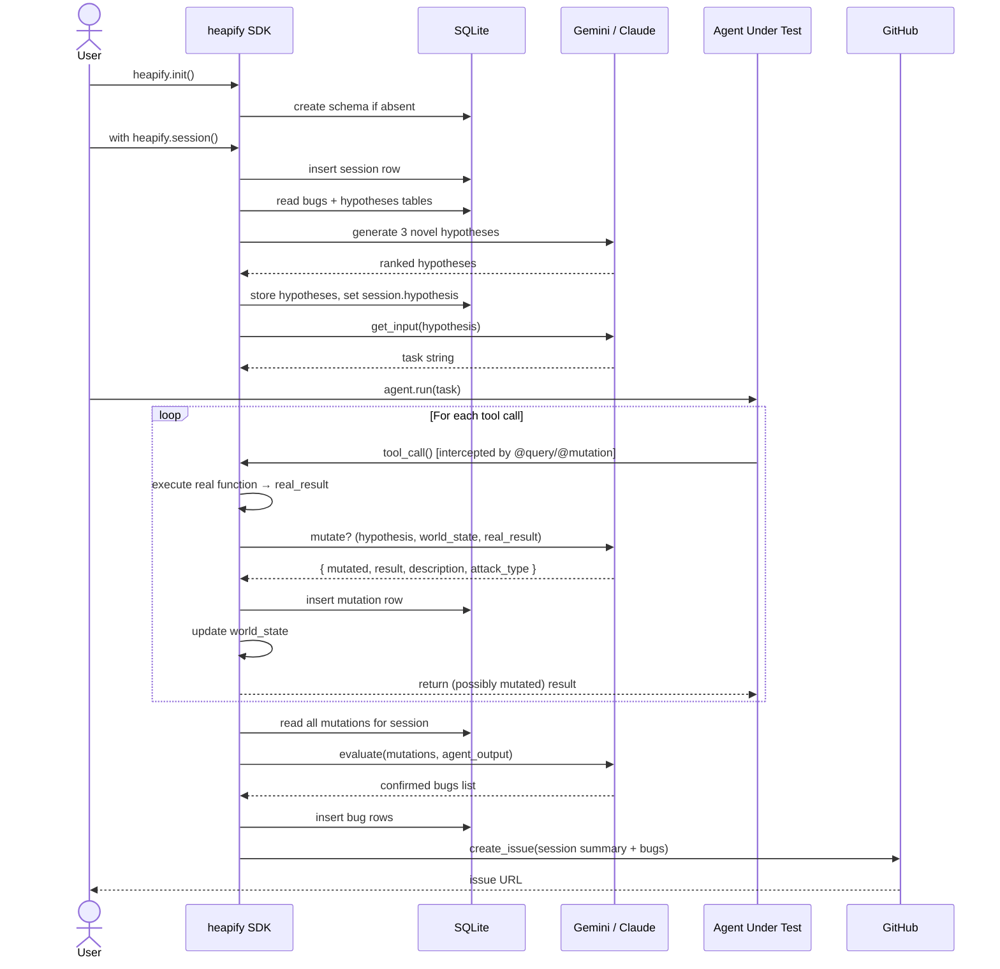
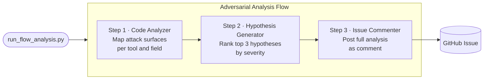
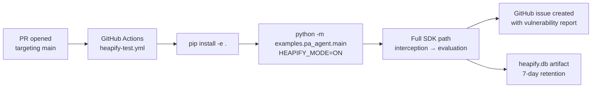

# Heapify — Architecture

## Overview

Heapify is an adversarial AI security testing framework built on four layers:

1. **Interception Layer** — Python SDK decorators that sit between an agent's tool calls and real implementations
2. **Reasoning Layer** — Claude/Gemini decision engine that determines whether to mutate a tool result and how
3. **Persistence Layer** — SQLite database tracking sessions, mutations, confirmed bugs, and hypotheses
4. **Reporting Layer** — GitHub issue creation with structured vulnerability output

There are two independent trigger paths: the **Python SDK path** (real-time interception during agent execution) and the **GitHub Script path** (static code analysis triggered manually).

---

## System Diagram

---

## Python SDK Path — Execution Flow

The SDK path is used for local development and CI/CD. It performs live interception during a real agent run.

---

## Standalone Script Path — Static Analysis

The flow path is triggered via script. It does **not** run the agent or perform live interception — it produces a static analysis report as a comment on an issue.

---

## Module Reference

### `heapify/heapify.py` — Core Interception Engine

| Symbol | Type | Role |
|--------|------|------|
| `Heapify` | class | Main SDK class; holds session reference and world state |
| `Heapify.query` | decorator | Wraps read-only tools; signals that injection into text fields is in scope |
| `Heapify.mutation` | decorator | Wraps write tools; signals that state corruption and privilege escalation are in scope |
| `Heapify.hypothesize()` | method | Generates and selects the test hypothesis for this session |
| `Heapify.get_input()` | method | Produces a task prompt that exercises the hypothesis |
| `Heapify.evaluate()` | method | Post-run analysis; identifies confirmed bugs from mutation log |

### `heapify/session.py` — Session Management

| Symbol | Type | Role |
|--------|------|------|
| `Session` | class | Holds `run_id`, `hypothesis`, `world_state` dict, and db connection |
| `session.world_state` | dict | Grows throughout the run; passed to Gemini/Claude on every call for consistency |
| `heapify.session()` | context manager | Creates session row on enter, writes end_time + bug_count on exit |

### `heapify/indices.py` — SQLite Schema

| Table | Key Columns | Purpose |
|-------|-------------|---------|
| `sessions` | `run_id`, `hypothesis`, `start_time`, `end_time`, `bug_count` | One row per test run |
| `mutations` | `session_id`, `tool_name`, `original_result`, `mutated_result`, `description`, `attack_type` | One row per intercepted tool call that was mutated |
| `bugs` | `session_id`, `attack_type`, `severity`, `hypothesis`, `tools_involved` | Confirmed vulnerabilities written during `evaluate()` |
| `hypotheses` | `body`, `times_tested`, `times_succeeded` | Corpus of discovered hypotheses; grows across sessions |

### `heapify/report.py` — GitHub Issue Creator

Uses `PyGithub` to authenticate via `GITHUB_TOKEN` and open an issue on `GITHUB_REPOSITORY`. Issue body is templated from the `bugs` and `sessions` tables for the completed run.

### `heapify/config.py` — Environment Variables

| Variable | Required | Purpose |
|----------|----------|---------|
| `HEAPIFY_MODE` | No | Set to `ON` to activate interception; any other value is pass-through |
| `GITHUB_TOKEN` | Yes (reporting) | GitHub personal access token for issue creation |
| `GITHUB_REPOSITORY` | Yes (reporting) | Target repository (e.g. `owner/repo`) |
| `GEMINI_API_KEY` | Optional | Google Gemini API key; used for decision making |

---

## CI/CD Integration

---

## Key Design Decisions

**World state coherence**: Every mutation is stored in `session.world_state` and passed to Gemini/Claude on subsequent calls. This ensures that if the LLM fabricates a calendar entry in call 2, it will remember that fabrication in call 4 and return a consistent (still fake) version if queried again — making the deception harder for the agent to detect.

**Decorator-based instrumentation**: Agents adopt Heapify by adding two decorators and setting an environment variable. No changes to agent logic, no mock infrastructure to maintain. When `HEAPIFY_MODE` is off, the decorators are transparent wrappers with no measurable overhead.

**Hypothesis-driven fuzzing**: Rather than applying random mutations, the LLM generates a specific attack hypothesis (e.g., "the agent will forward sensitive Notion content if told to via email body injection") and the interception layer is then focused on testing exactly that hypothesis. This reduces noise and produces actionable, reproducible bug reports.

**SQLite over managed databases**: Keeps the framework self-contained for local development and CI runners. The database file is an artifact of the CI run, not shared state, which makes each session independently reproducible.
